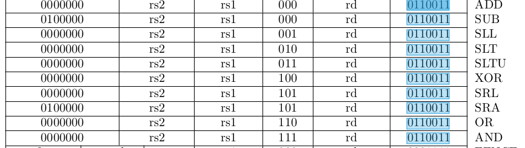

# 练习5-1
题目：
- 对 code/asm/sub 执行反汇编,查看 sub x5, x6, x7 这条汇编指令对应的机器指令的编码,并对照RISC-V 的 specificaion 自己解析该条指令的编码。
- 现知道某条 RISC-V 的机器指令在内存中的值为 b3 05 95 00,从左往右为从低地址到高地址,单位为字节,请将其翻译为对应的汇编指令。
----
## 题1
反汇编查看
```
        sub x5, x6, x7          # x5 = x6 - x7
80000008:       407302b3                sub     t0,t1,t2
```

- 407302b3的二进制为1000000011100110000001010110011
查表后SUB格式对应如下

| 0100000 | rs2 | rs1 | 000 | rd | 0110011 | SUB |
|---------|---------|---------|---------|---------|---------|---------|
| 0100000 | 00111 | 00110 | 000 | 00101 | 0110011 |SUB|

- `0100000`：这是指令的`opcode`字段，它指定了该指令是一个算术逻辑指令。
- `rs2`：这是源寄存器2（Source Register 2）字段，它指定了减法操作的第二个操作数，即`x7`寄存器。
- `rs1`：这是源寄存器1（Source Register 1）字段，它指定了减法操作的第一个操作数，即`x6`寄存器。
- `000`：这是功能字段，用于特定的指令变种，对于此指令来说，它未被使用。
- `rd`：这是目标寄存器（Destination Register）字段，它指定了减法操作的结果将存储到哪个寄存器中，即`x5`寄存器。
- `0110011`：这是指令格式字段，表示这是一个RISC-V的标准I指令格式。

## 题2

高地址到低地址

| 00 | 95 | 05 | b3 |
| -- | -- | -- | -- |
| 00000000 | 10010101 | 00000101 | 10110011 |


`00`和 `b3`对应图中ADD指令
拆分如下:

| 0000000 | rs2 | rs1 | 000 | rd | 0110011 |
| -- | -- | -- | -- | -- | -- |
| 0000000 | 01001 | 01010 | 000 | 01011 | 0110011 |


所以汇编指令为 ADD x11,x10,x9