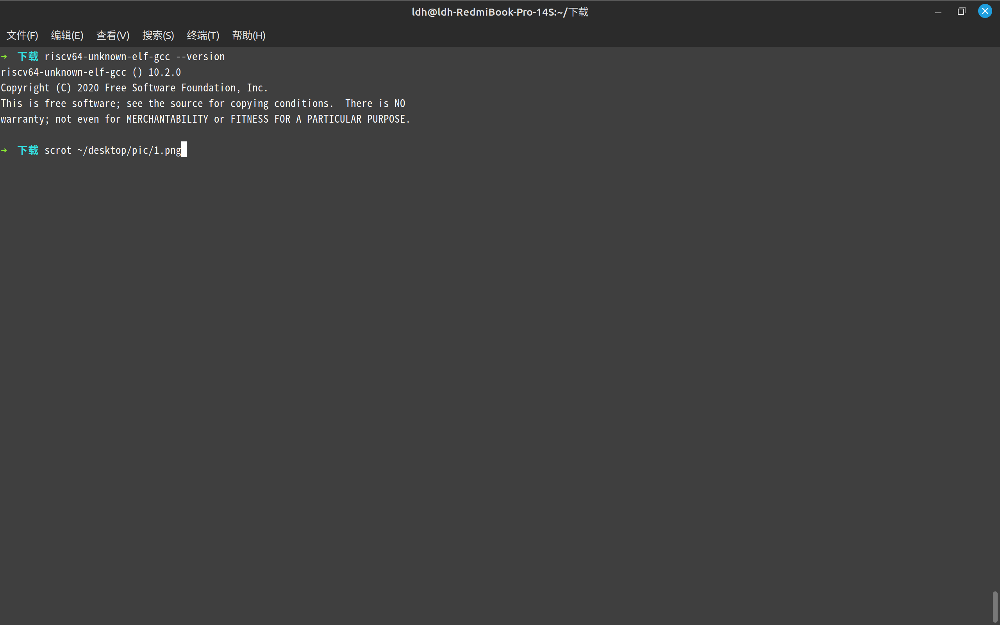
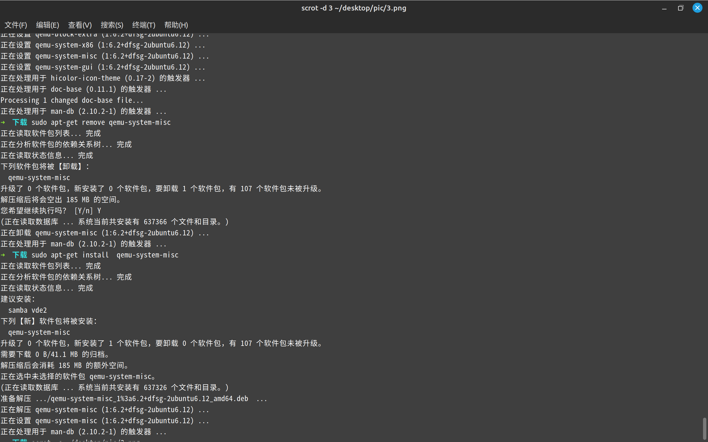
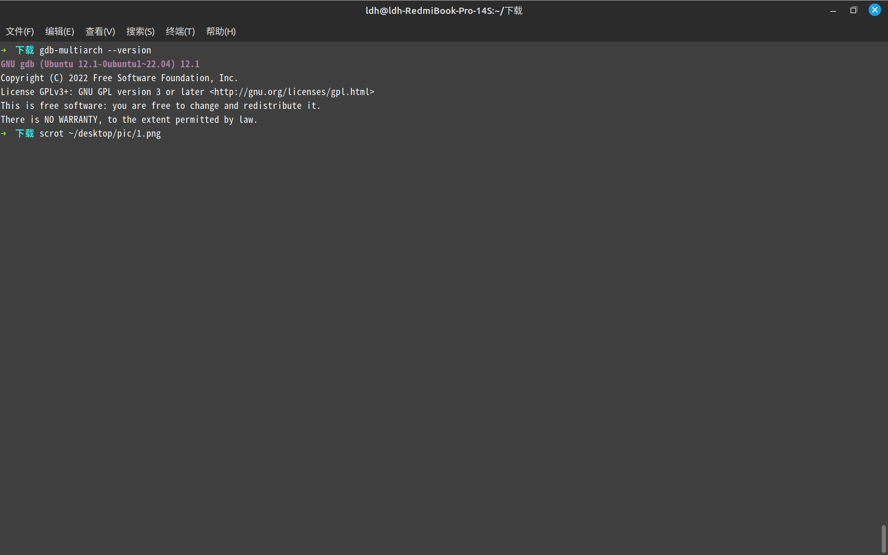
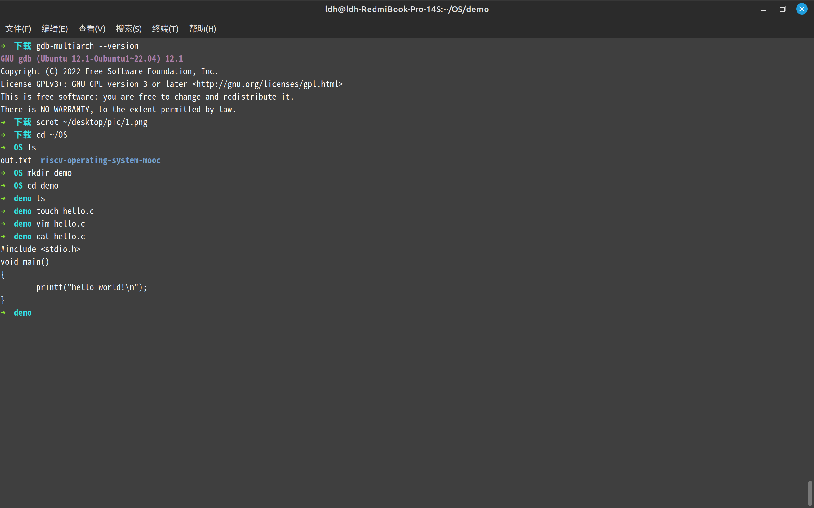
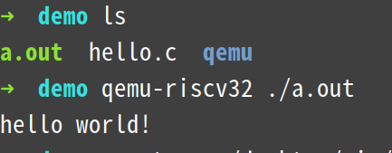

<p>
    <center><font size=8 face="楷体">操作系统实践课程结课报告</font></center><br>
	<center><font size=5 face="楷体">目标：环境搭建 </font></center>
	<center><font face="楷体">作者：李东航（学号：20212241283）</font></center>
	<center><font face="楷体">日期：2023年7月</font></center>
</p>

# 环境
- 系统版本：Linux Mint 21.1
- 内核版本：5.15.0-73-generic
# 工具的安装
## 交叉编译器gcc的安装
1. 概念
>交叉编译器是一种可以在一种操作系统或体系结构上生成另一种操作系统或体系结构上的可执行文件的编译器。它允许开发人员在一台计算机上编写程序并将其编译为在另一种计算机上运行的程序。交叉编译器通常用于开发嵌入式系统或移动设备应用程序，其中开发人员需要在开发计算机上编写代码并将其编译为在目标设备上运行的程序。
2. gcc的安装
```bash
sudo apt install gcc-riscv64-unknown-elf
```


## 模拟器qemu的安装
1. 概念
> QEMU是一个开源的模拟器和虚拟机管理器，可以模拟多种体系结构的计算机硬件，并在其上运行不同的操作系统。
2. 安装
```bash
sudo apt-get install qemu-system-misc qemu-user
```

## 调试器gdb的安装
1. 概念
> GDB，GNU项目调试器，用于查看另一个程序在执行过程中正在执行的操作，或该程序崩溃时正在执行的操作
2. 安装
```bash
sudo apt install gdb-multiarch
```

# 调试
1. 创建hello.c文件

2. 使用gcc编译
```bash
riscv64-unknown-elf-gcc -march=rv32ima -mabi=ilp32 hello.c 
```

3. 使用qemu的user模式直接运行a.out文件
```bash
qemu-riscv32 ./a.out
```



<h3><center>参考文献</center></h3>

[1]  [CSDN](https://blog.csdn.net/LostUnravel/article/details/120397168#t1)</br>
[2]  [RISC-V环境配置](https://decaf-lang.github.io/minidecaf-tutorial/docs/step0/riscv_env.html)